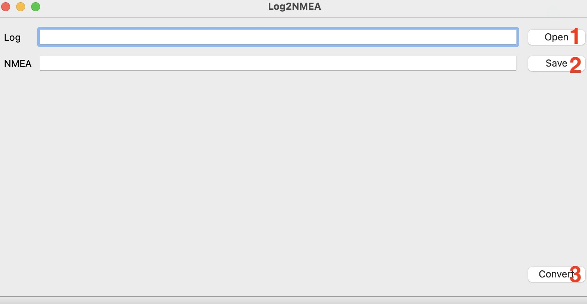

# GPS LOG to NMEA

A very simple tool to convert GPS logs to NMEA file. 

## Usage CLI mode

You can create the soft link for MacOS or Linux OS to use the CLI mode.

- MacOS

```
sudo ln -s /Applications/log2nmea.app/Contents/MacOS/log2nmea /usr/local/bin/log2nmea
```
- Linux

```
TODO
```

### Convert one log
```
log2nmea -i aa.log -o aa.nmea
```
or without -o, it will create the same filename with `.nmea` extension as the input file.

```
log2nmea -i aa.log
```

### Convert more logs
```
log2nmea -i aa.log  -i bb.txt -i cc.tmp -o aa.nmea -o bb.nmea -o cc.nmea
```
or without -o, it will create the same filename with `.nmea` extension as each input file.

```
log2nmea -i aa.log -i bb.txt -i cc.tmp
```

  
## Usage GUI mode



- Step 1: Select the log file
- Step 2 (*optional*): It will create the nmea file by default, you can change the file name as you want.
- Step 3: Convert 
